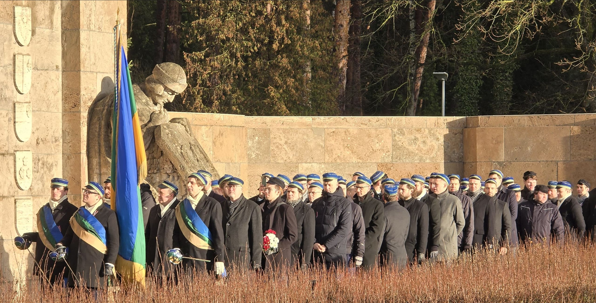

## About Fraternitas Lettica

Founded: 20 October 1902.\
Guarantor of the comment: the student fraternity Tervetia\
Active members: 114 (figures for the 2nd semester of 2026)

18 November 2025

## History

The beginnings of the fraternity Fraternitas Lettica are to be found in Moscow at the time of the first national awakening, in the late 1860s. Under the leadership of Krišjānis Valdemārs, a number of Latvians living in Moscow came together to become aware of and to collect the spiritual heritage of the Latvian people, to study the history of Latvia, to develop the Latvian language and to publish articles in the newspapers. So arose what were called the Latvian reading evenings of Moscow. The first meeting was on 20 October 1870.

Among those who took part in the evenings were notable Latvians such as Krišjānis Valdemārs, Krišjānis Barons, Fricis Brīvzemnieks, Krišjānis Kalniņš, Jānis Krodznieks, Frīdrihs Veinbergs, Andrejs Šlēziņš, Jānis Sietiņsons, Aleksandrs Vēbers, Jēkabs Velme and Ansis Bandrevičs.

Out of this circle grew the Latvian Students’ Evening of Moscow, founded on 19 October 1883 with the character of a more definite organisation and with statutes, so coming closer to the structure of a student fraternity and to the values of the academic spirit.

Around the turn of the century the students’ evenings were in fact already working as a student fraternity, as far as that was possible in Moscow. This was made official on 12 January 1902, when philisters and students together drew up the statutes of the fraternity on the premises of the Riga Latvian Society and adopted the name Fraternitas Moscoviensis. The colours (blue, green and gold) and the statutes were approved by the authorities on 26 March 1913. Today the members of Fraternitas Lettica are called “fraters”, because it was the first Latvian student fraternity still active today to use the word “fraternitas” in its name.

With the October coup and the Russian Civil War the fraternity ceased its work in Moscow. Many of its members returned to Latvia and at the end of 1918 joined the Separate Student Company (A!S!R!), Kalpaks’ battalion and other anti-Bolshevik Latvian units, about 50 fraters in all. It is known that 11 fraters served in the ranks of the A!S!R! (4 joined the fraternity before the end of the War of Independence and 7 after it). Nine fraters were awarded the military Order of Lāčplēsis.

In the autumn of 1919 the fraters took part in founding P!K!, and theirs is one of the five founding fraternities of P!K!. The convent of the fraternity’s philisters and active members was officially restored on 27 September 1920, and the name was changed to Fraternitas Lettica at the suggestion of the philister Pēteris Šmits.

For a time the convent quarters were in rented rooms in Strēlnieku iela, but in 1928 suitable rooms were built for the fraternity in the house at Lāčplēša iela 5 given by the philister Andrejs Krastkalns, which is the fraternity’s convent quarters to this day.

In the time of the first Latvian republic Fraternitas Lettica led P!K! three times. The fraters also took an active part in the P!K! Men’s Choir and Symphony Orchestra, and besides in the Student Council and the organisations under it, in Universitātes Sports and in international student organisations. In turn with the other four oldest fraternities, Fraternitas Lettica kept the flag of the Separate Student Company.

Attached to the fraternity was a Philisters’ Society, which took part in founding the Union of Philisters’ Societies (F!B!S!).

When the occupation by the Soviet Union began, Fraternitas Lettica ceased its work in 1940. Under the Bolshevik regime 58 fraters were repressed. Ten members are known to have been killed. The rest were deported. Only 11 of them returned to Latvia. Most were deported in 1941 itself (35), of whom only 3 returned.

During the occupation by Nazi Germany, too, the fraternity was unable to resume active work, although a few gatherings and commerses were held. About 20 fraters, volunteers and conscripts, fought in the armed forces of Germany, in the so-called “Latvian Legion” and other units. Eight fraters are known to have remained on the battlefields. In 1944 and 1945 most of the fraters went into exile. When the war ended, active work was restored, with the student fraternity and the philisters’ society united in a single organisation. The Fraternitas Lettica Fund was founded, which gives help to fraters and members of their families in exile and in the homeland. In 1953 the convent resumed admitting new members to the fraternity. On 19 October 1969 the convent adopted a new internal comment of the fraternity and rules for applying it in the fraternity’s chapters. Fraternitas Lettica presided over L!K!A! in 1964/65 and 1983/84.

As the Soviet regime neared its end, at a special meeting called on 12 May 1989 the 11 philisters present decided to restore the work of Fraternitas Lettica in Latvia and to admit 5 new members, who made up the coetus of 1989-I (the men who joined in one semester). The University of Latvia approved the fraternity’s statutes in April 1990.

Through the ardent work of the fraters who are lawyers, the fraternity succeeded in regaining its convent building in Riga. The legal recovery of the property took nine years. Even before it was regained, in 1992 the fraters set to work and began extensive restoration of the building.

In 2019 repairs to the whole convent building were begun again. It was found that the façade of the building on the Lāčplēša iela side had leaned over and had to be straightened. Misfortune came when a fire broke out on the 2nd floor in the autumn semester of 2019, which complicated the repairs and made them more expensive. The donations of the philisters were very valuable in securing the money to carry out the repairs. In September 2025 the restored convent hall on the 1st floor was opened.
