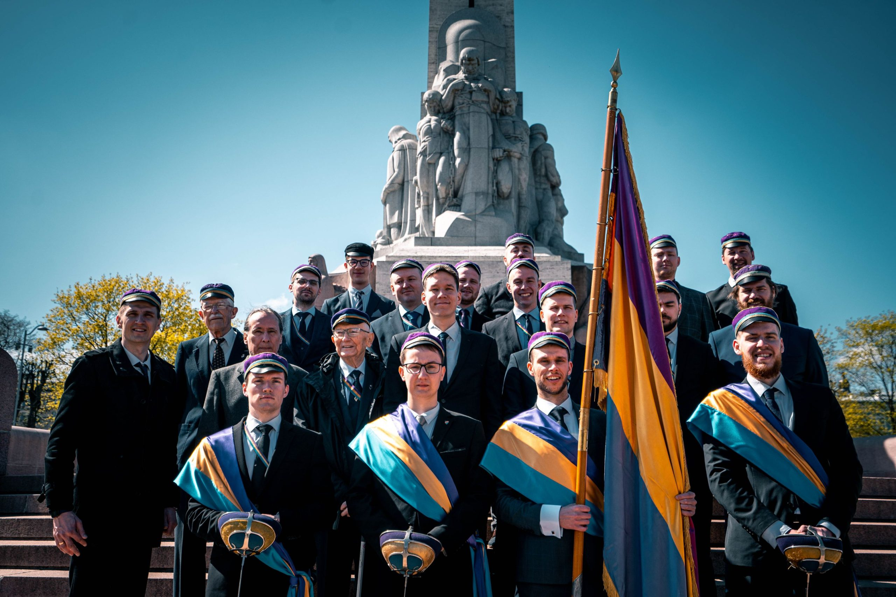
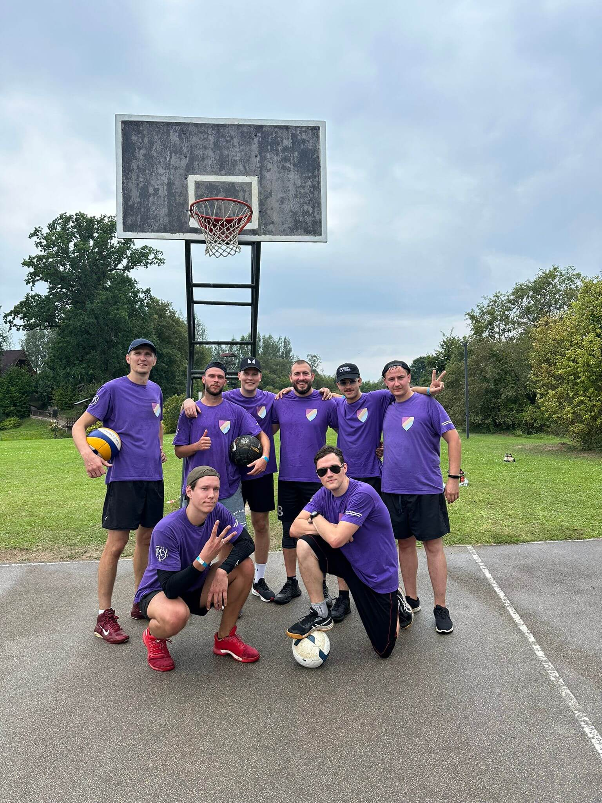
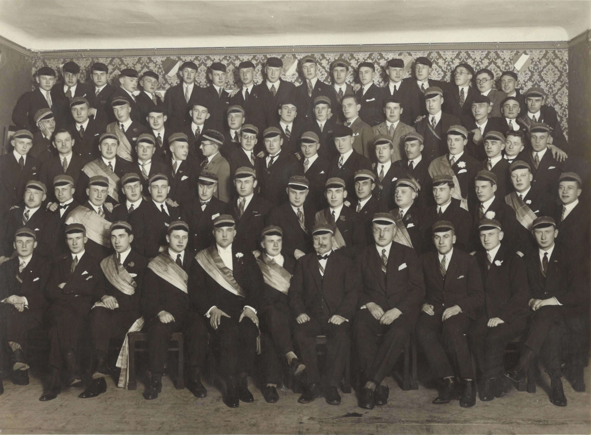

## Par Beveroniju

Dibināšanas datumi:

- dibināšanas konvents 1922. gada 9. martā;
- dibināšanas komeršs 1922. gada 4. maijā;
- krāsu atklāšana 1923. gada 23. oktobrī.

Komāna garants – Lettonia\
Aktīvās ārzemju kopas – Čikāga, Ņujorka, Melburna\
Aktīvo biedru skaits – 75

## Aizraušanās

Beveroņi regulāri nodarbojas ar tādu komandas sporta veidu spēlēšanu kā volejbols, basketbols un futbols, kuplā skaitā piedalās buršu rīkotos zoles turnīros, kā arī aktīvi iesaistās dienestā Zemessardzē.

## Vēsture

Korporācijas Beveronijas dibināšana cieši saistīta ar vienreizēju latviešu nacionālās dzīves uzplaukumu, kas sekoja Latvijas brīvības cīņām. Jaunās latviešu korporācijas dibināšanu sekmēja nacionālā sajūsma un garīgie centieni, kuru ietekmē veidojās akadēmiskā dzīve neatkarīgās Latvijas valsts un toreizējās Latvijas augstskolas pirmajos gados. Beveronijas dibinātāji bija 16 imatrikulēti Latvijas augstskolas studenti no astoņām dažādām fakultātēm.

Jaunās korporācijas dibināšana prasīja daudz darba un pūļu, bet Beveronijas dibinātāji, pirmo semestru tautiešu atbalstīti, visus šķēršļus veica ar lielu sajūsmu. Beveronija pirmajos pastāvēšanas gados uzņēma desmit goda filistrus.
